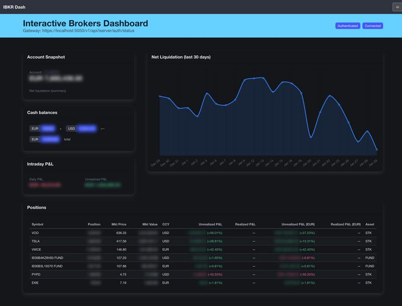

# IBKR Dash

A lightweight PHP dashboard for Interactive Brokers that shows:

- Net liquidation chart (last 30 days)
- Positions with P&L and base-currency P&L
- Cash balances
- Intraday P&L (partitioned)
- Gateway status
- Privacy toggle to blur sensitive amounts for sharing

The app depends on the IBKR Client Portal Gateway. For long-lived sessions, [ibeam](https://github.com/Voyz/ibeam) is recommended.

## Screenshot



## Requirements

- PHP 8.x (tested with built-in server)
- IBKR Client Portal Gateway running locally
- APCu (optional, but recommended for 5‑minute API caching)

## Setup

1. Copy the environment file:

```bash
cp .env.example .env
```

2. Adjust `.env` if needed:

```
GATEWAY_BASE_URL=https://localhost:5050/v1/api
```

## Run

```bash
php -S 127.0.0.1:5080
```

Open:

```
http://127.0.0.1:5080/
```

## Telegram Report (optional)

`telegram.php` sends a daily summary (yesterday’s performance, CET/CEST) to a Telegram chat.

```
TELEGRAM_TOKEN=...
TELEGRAM_CHAT=...
```

Run:

```bash
php telegram.php
```

## Notes

- API calls are cached for 5 minutes when APCu is available.
- Base-currency P&L uses `/pa/transactions` (days param) for historical FX and cost basis.
- Intraday P&L uses `/iserver/account/pnl/partitioned`.
- The dashboard assumes the Client Portal Gateway is already authenticated.
